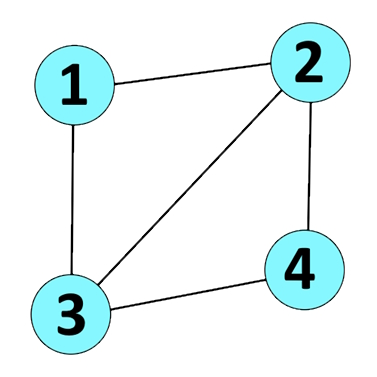

# NP-Complete Problems in Practice

### Work Cited
Giannoula, G. 2018, January 30. Graph Coloring: The Sudoku Solver. Linkedin. https://www.linkedin.com/pulse/graph-coloring-sudoku-solver-christina-giannoula/

Chauhan, Y. 2020, October 1. 3-coloring is NP Complete. GeeksforGeeks. https://www.geeksforgeeks.org/3-coloring-is-np-complete/

Bhuyan, A. 2023, June 11. Understanding Graph Coloring: An Essential Concept in Graph Theory. Faun.pub. https://faun.pub/understanding-graph-coloring-an-essential-concept-in-graph-theory-c40de8421745

### Area of Computing
I’ve chosen to cover a problem in networking. Graph coloring is useful in wireless networking, despite it also being useful in other things like coloring maps, solving sudokus, and optimizing compilers. Graph coloring helps many wireless technologies assign channels to clients. A wireless channel is basically a frequency, so there’s problems because there can be many clients, but the access point can only broadcast to a finite number of frequencies. In this case clients can be thought of as a receiver and is generally a device that needs communication. My cell phone can be a client for a cell tower, a speaker can be a Bluetooth client for my phone, and my computer can be a Wi-Fi client for my wireless access point. Furthermore, if too many clients get on similar frequencies the signals may interfere with each other, especially when they’re nearby each other. 

### Graph Coloring Formal Definition
###### I copied the formal definition from geeksforgeeks ensuring accuracy
Given a graph G and an integer K, decide if there’s a coloring such that no two adjacent vertices share a color in G using K colors (Chauhan, 2020). The smallest number of colors required to color a graph is also simply referred to as the graph’s chromatic number. The question can be rephrased as ‘is the graphs chromatic number at most k?’

Given G(V, E), K ∈ ℤ  
Is there a coloring such that  
Colors C = (c1, c2, … ck), |C| = K, Colors vertices such that  
The color of any vertex cv ∈ C and given any edge E=(va, vb)  
The color of va ≠ vb  

### How Graph Coloring Models Networking Assigning Channels or Frequencies
Graph coloring is used to model wireless networks by making a graph of the network. Each client becomes a vertex, and edges are added between the vertices of clients that may interfere with each other. K is the number of frequencies available (Bhuyan, 2023). The problem can also have special cases that the graph coloring problem doesn’t model well but can be altered to do so. Examples could be devices that work best on certain frequencies and if edges can have weights depicting how much interference is acceptable and trying to minimize the sum of edge weights of same-color adjacent vertices. 

### Example 
Call this graph G.  

Color(G, 3) is a True instance. 'This graph can be colored such that no two adjacent vertices share a color with three colors'. Here’s an example of a valid coloring:  
- c1 -> v1  
- c1 -> v4  
- c2 -> v2  
- c3 -> v3  

Simply, color vertices 1 and 4 red, vertex 3 green, and vertex 2 yellow.

Color(G, 2) is a False instance since there does not exist a valid coloring without having at least one edge with nodes sharing a color. 
